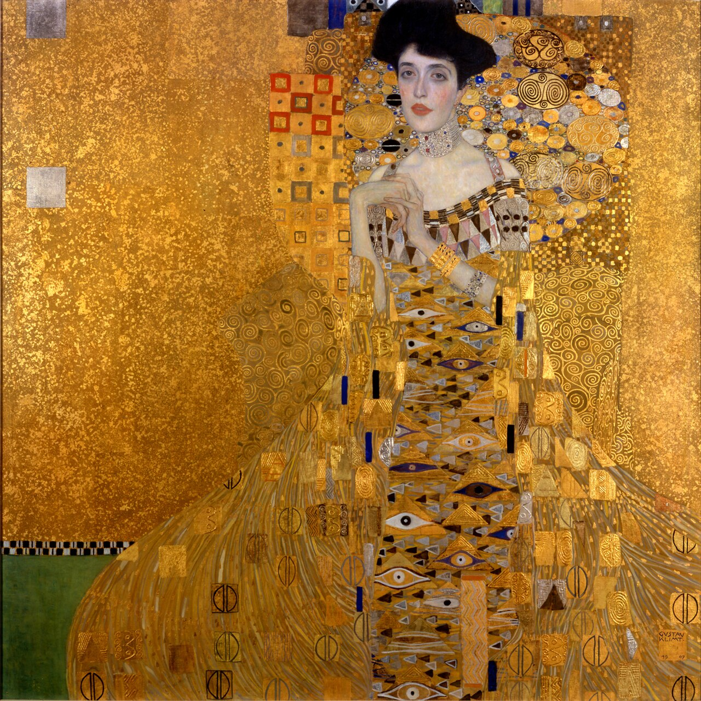
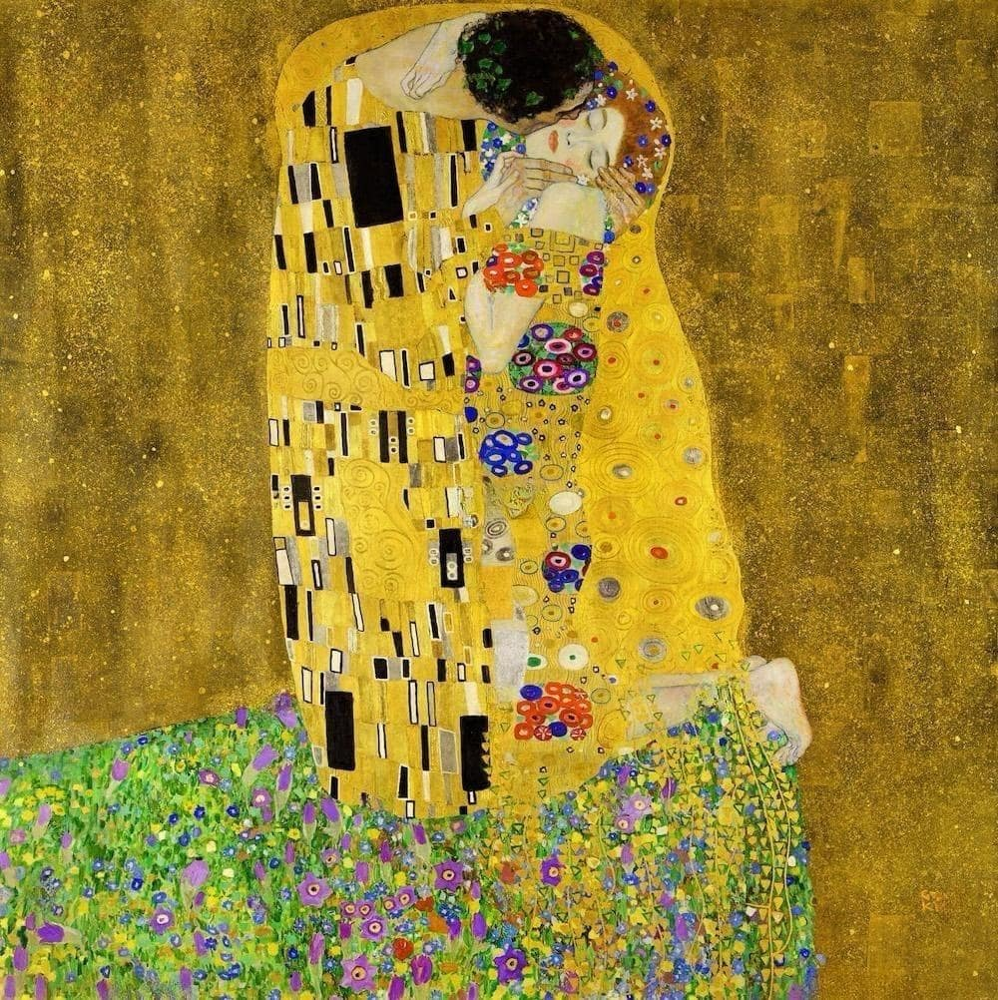

# Quiz 9

---

## Part 1: Project Direction

### Reinterpreting an Existing Artwork

**Artwork:** *Portrait of Adele Bloch-Bauer I* (1907) → *The Kiss* (1907–08)
**Artist:** Gustav Klimt

Our project uses two works by Klimt as a pair — the first painting (*Adele*) is the starting state, and the second (*The Kiss*) is the hidden destination revealed through interaction.

*Gustav Klimt, Portrait of Adele Bloch-Bauer I, 1907 — Neue Galerie, New York*

*Gustav Klimt, The Kiss, 1907-1908 — Österreichische Galerie Belvedere, Vienna, Austria*

---

### Vision & Inspiration

Our team will reinterpret two artworks by Gustav Klimt, Portrait of Adele Bloch-Bauer I (1907) and The Kiss (1908), through interactive particle-based visuals built in p5.js. Klimt's richly layered geometric ornamentation, golden spirals, and decorative mosaic surfaces naturally translate into a grid of dynamic shape particles that reconstruct each painting from thousands of individual elements.

Our interactive inspiration comes from two digital works: Interactive Image Explorer on YouWare, which rebuilds a portrait "one circle at a time" through circle-based halftone mapping, and Liquid Fabric, a physics-driven cloth simulation where surfaces ripple and tear in response to user input. Drawing from both, we will create a mosaic particle system that allows users to interactively reveal and switch between the two Klimt paintings, with each transition animated through dissolving and reforming geometric patterns.

**Inspiration Source 1**

*Gustav Klimt, The Kiss, 1907–08 — Österreichische Galerie Belvedere, Vienna*

**Inspiration Source 2**

*Refik Anadol, Unsupervised, MoMA 2022 — Wikimedia Commons*

---

## Part 2: Mechanics

### Yuanxin Yu — Perlin Noise & Randomness: Organic Tile Texture

Rather than breaking the canvas into a uniform grid of identical squares, Member 1 will use Perlin noise to control the size of each mosaic tile across the canvas. Areas of high noise value will produce larger tiles; areas of low value will produce smaller, denser ones — giving the mosaic a breathing, irregular quality that echoes Klimt's original handmade gold-leaf application. On top of this, `randomSeed` will introduce subtle colour variation within each tile: even tiles sampling the same gold region of the source painting will differ slightly in hue and saturation, simulating the way real gold leaf catches light differently across its surface. Together, these two techniques replace a mechanical grid with something that feels handcrafted and alive.

---

### Carol Tao — Audio: Music-Driven Flip Rhythm

The audio mechanic uses FFT-based frequency analysis to drive the rhythm and behaviour of the mosaic tiles. We will use a public-domain classical track such as **[Erik Satie’s Gymnopédie No.1](https://open.spotify.com/track/0VvRugX9TycXfcEgLPKLpB)**, whose soft dynamics and slow tempo complement Klimt’s ornamental aesthetic. Low-frequency energy triggers large-tile flips, mid-frequency ranges create shimmering pulses, and high-frequency peaks generate fine flickers resembling gold leaf catching light. Louder musical passages accelerate the spread of mosaic transformation, while quiet sections slow or pause the motion. The user does not directly control this mechanic; instead, the music becomes an invisible performer shaping the artwork’s emotional pacing. This mechanic reinforces our vision by giving the golden surface a breathing, ceremonial rhythm that echoes Klimt’s layered luminosity.

---

### Xiaorong Dang — Time-based: Countdown & Animated Reveal

After the user's first click, Member 3 will start a 30-second countdown timer. If the user stops interacting, already-mosaiced tiles will continue to spread outward automatically at a slow rate. When the countdown reaches zero, any remaining un-flipped tiles will complete in a rapid chain reaction — a cascade that sweeps across the canvas and delivers the final reveal of *The Kiss*. The transition to the completed second painting will use an easing curve (slow-in, fast-out) to give the finale a sense of ceremony and weight. This time structure means the piece always resolves, but rewards active viewers who accelerate it themselves.

---

### Liqi Lu — User Input: Ripple Mosaic

Member 4 gives the viewer direct control over the transformation. Each mouse click on the canvas triggers a ripple of mosaic tiles expanding outward from the click point, the tiles nearest the cursor flip first, followed by a wave of surrounding tiles, creating a circular pond-ripple spreading effect. Each click permanently alters the canvas, allowing the viewer to gradually reconstruct another picture through repeated interaction. Different regions of the painting respond in visually distinct ways. Clicking on facial features generates fine, dense mosaic tiles that preserve detail and delicacy, while clicking on the gold decorative background produces larger, bolder tiles that emphasise abstraction and texture. A hover preview effect means that as the cursor moves across the canvas, the tiles immediately beneath it become slightly pixelated, hinting to the viewer that this area can be clicked and inviting further exploration.

---

## Part 3: Putting It Together

All four mechanisms operate within the same painting. A grid of mosaic tiles, depending on the number of tiles flipped, eventually forms a pattern resembling Adele or a kiss. User input determines where the tiles begin to flip on the canvas; a time-based mechanism ensures the transformation always occurs within a fixed timeframe; an audio mechanism links the speed and rhythm of the flips to the energy of music; and Burmester noise ensures no two tiles look exactly alike, giving the entire image a warm, handcrafted feel. Visually, Klimt's gold palette perfectly blends all elements together—the mosaic tiles, the shimmering effects, and the final painting all share the same amber, ochre, and warm black tones.

---
